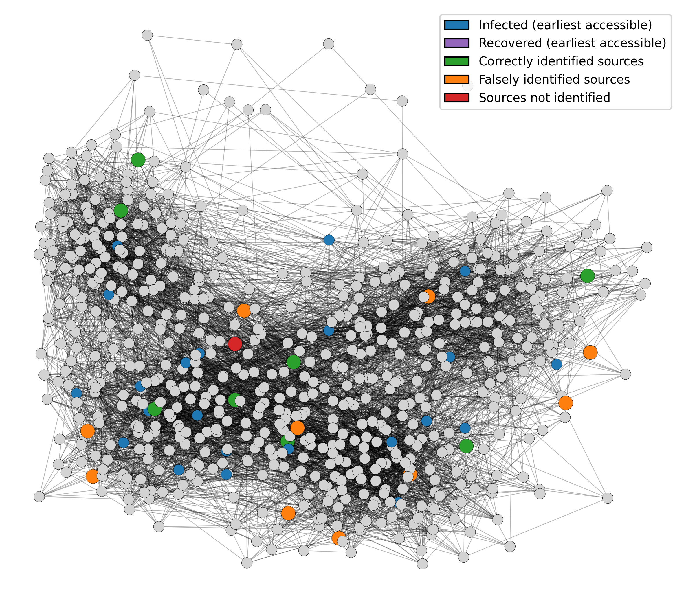

# Conformalized Network Source Detection

## About the Project

This is the official implementation of the paper *Conformal Prediction for Multi-Source Detection on a Network* (CPNET with CLM - Conformal Label-set Prediction for Multi-source detection). The goal is to provide **confident detection** of information propagation sources on a network using conformal prediction techniques.

### Key Components

- **CPNET (main.py)**: The main conformal prediction pipeline that takes pre-trained SD-STGCN model predictions and produces statistically-valid prediction sets for source identification.
- **SD-STGCN**: Spatial-Temporal Graph Convolutional Network for source detection. This component generates the initial per-node source probability predictions (`res.pickle`) that feed into the conformal prediction pipeline.



---

## Repository Map

```
Conformalized-Network-Source-Detection/
├── main.py                      # Main conformal prediction pipeline entry point
├── main_mismatch.py             # Alternative main for mismatched train/test settings
├── visualization.py             # Visualization utilities for source detection results
├── batch_CP_process.sh          # Batch script to run multiple CP experiments
├── batch_CP_process_*.sh        # Additional batch experiment scripts
├── requirements.txt             # Python dependencies
│
├── SD-STGCN/                    # Spatial-Temporal GCN for source detection
│   ├── main_SIR_*.py            # Training scripts for various settings
│   ├── test_SIR_*.py            # Test/evaluation scripts
│   ├── dataset/                 # Graph datasets and simulation data
│   │   ├── <graph_name>/
│   │   │   ├── data/graph/      # Network edgelist files
│   │   │   ├── data/SIR/        # Simulation data pickles
│   │   │   └── code/            # Data generation scripts
│   ├── output/
│   │   ├── models/              # Trained SD-STGCN model checkpoints
│   │   └── test_res/            # Test predictions (res.pickle files)
│   └── data_loader/             # Data loading utilities
│
├── utils/                       # Utility functions
│   ├── score_convert.py         # Conformity score functions (APS, recall, precision)
│   └── functions.py             # Helper functions including get_test_results()
│
├── DSI/                         # Diffusion Source Identification baseline (ADiT-DSI)
│
├── data/                        # Cached copies of graph and test results
│   └── <graph_name>/
│       ├── graph/               # Copied edgelist files
│       └── test_res/            # Copied res.pickle files
│
├── results/                     # Output directory for CP experiment results
│   └── <graph_name>/<test_exp_name>/pow_expected<value>/
│       ├── coverage_table.csv   # Coverage results table
│       ├── set_size_table.csv   # Prediction set size table
│       ├── time_cost_table.csv  # Runtime table
│       ├── coverage_boxplot.pdf # Coverage visualization
│       ├── set_size_boxplot.pdf # Set size visualization
│       └── visualizations/      # Per-sample visualization plots
│
├── logfiles/                    # Experiment log outputs
├── analysis_results/            # Additional analysis outputs
├── docs/                        # Documentation
│   ├── pipeline.md              # Step-by-step pipeline guide
│   ├── configuration.md         # CLI argument reference
│   └── output_format.md         # Output file format descriptions
│
└── examples/                    # Example scripts
    ├── run_one_experiment.sh    # Single experiment runner
    └── expected_outputs.md      # Expected output files after running
```

---

## Data and Artifacts

### Inputs

| Artifact | Path | Description |
|----------|------|-------------|
| Graph edgelist | `SD-STGCN/dataset/<graph>/data/graph/<graph>.edgelist` | Network topology file |
| Simulation data | `SD-STGCN/dataset/<graph>/data/SIR/<exp_name>_entire.pickle` | Epidemic simulation trajectories |
| Trained model | `SD-STGCN/output/models/<graph>/<train_exp_name>/` | TensorFlow checkpoint files |
| Test predictions | `SD-STGCN/output/test_res/<graph>/<test_exp_name>/res.pickle` | SD-STGCN prediction outputs |

### Outputs

| Artifact | Path | Description |
|----------|------|-------------|
| Coverage CSV | `results/<graph>/<exp>/pow_expected<p>/coverage_table.csv` | Coverage rates per method and α |
| Set size CSV | `results/<graph>/<exp>/pow_expected<p>/set_size_table.csv` | Average prediction set sizes |
| Time cost CSV | `results/<graph>/<exp>/pow_expected<p>/time_cost_table.csv` | Runtime statistics |
| Coverage plot | `results/<graph>/<exp>/pow_expected<p>/coverage_boxplot.pdf` | Boxplot visualization |
| Set size plot | `results/<graph>/<exp>/pow_expected<p>/set_size_boxplot.pdf` | Boxplot visualization |
| Calibration indices | `results/<graph>/<exp>/pow_expected<p>/calib_index_repeat<i>.npy` | Calibration set indices |

### The `res.pickle` Schema

The critical intermediate file `res.pickle` contains SD-STGCN model outputs:

```python
{
    'predictions': list,      # List of batches, each (batch_size x n_nodes x 2) array
                              # [:, :, 1] gives P(node is source)
    'ground_truth': list,     # List of batches, each (batch_size x n_nodes) one-hot array
    'inputs': list,           # List of batches, each (batch_size x n_nodes) with values
                              # 0=susceptible, 1=infected, 2=recovered at t=0
    'logits': list            # Raw logits before softmax (batch_size x n_nodes x 2)
}
```

---

## Getting Started

### Prerequisites

Create and activate a Python 3.8 environment:

```bash
conda create -n cpnet python=3.8.20
conda activate cpnet
```

(Optional) Install CUDA toolkit for GPU support:

```bash
conda install -c conda-forge cudatoolkit=10.1.243
```

Install required packages:

```bash
pip install -r requirements.txt
```

### Data Preparation

**Option A: Use pre-generated data (recommended)**

If pre-generated data exists, combine it into the expected format:

```bash
cd SD-STGCN/output/test_res
python data_prepare.py --combine 1 --split 0
cd ../../../
chmod +x batch_CP_process_loaddata.sh
./batch_CP_process_loaddata.sh
```

**Option B: Generate simulation data from scratch**

```bash
cd SD-STGCN/dataset/<graph_name>/code
chmod +x run_entire_mix_random.sh
./run_entire_mix_random.sh <n_frames> <n_samples> <model> <min_src> <max_src> <min_R0> <max_R0> <min_gamma> <max_gamma> <instance>
```

Example:
```bash
cd SD-STGCN/dataset/highSchool/code
./run_entire_mix_random.sh 16 21200 SIR 1 15 1 15 0.1 0.4 2
```

---

## Quickstart: Run One Experiment

**Prerequisite**: Ensure you have:
1. Graph file at `SD-STGCN/dataset/highSchool/data/graph/highSchool.edgelist`
2. Test data at `SD-STGCN/dataset/highSchool/data/SIR/<test_exp_name>_entire.pickle`
3. Trained model at `SD-STGCN/output/models/highSchool/<train_exp_name>/`

Run a single conformal prediction experiment:

```bash
python main.py \
    --graph highSchool \
    --train_exp_name SIR_nsrc1-15_Rzero1-15_gamma0.1-0.4_ls21200_nf16 \
    --test_exp_name SIR_nsrc1-15_Rzero1-15_gamma0.1-0.4_ls8000_nf16 \
    --pow_expected 0.5 \
    --prop_model SI \
    --set_recall 1 \
    --set_prec 1 \
    --set_min 1 \
    --mc_runs 10
```

Results will be saved to `results/highSchool/SIR_nsrc1-15_Rzero1-15_gamma0.1-0.4_ls8000_nf16/pow_expected0.5/`.

See [`examples/run_one_experiment.sh`](examples/run_one_experiment.sh) for a complete runnable script.

---

## Visualization

Generate source detection visualizations for a specific sample:

```bash
python visualization.py --sample_index 6
```

This produces PNG figures showing:
- Initial infected/recovered states
- Correctly/incorrectly identified sources
- Missed sources

---

## Common Problems / Troubleshooting

### Missing `res.pickle`

**Error**: `FileNotFoundError: ... res.pickle`

**Solution**: The SD-STGCN model predictions haven't been generated yet. Either:
1. Run the SD-STGCN test script first (see `SD-STGCN/README.md`)
2. Ensure `SD-STGCN/output/test_res/<graph>/<exp_name>/res.pickle` exists

The `main.py` script will attempt to generate it automatically if the trained model and test data exist.

### Missing Dataset

**Error**: `FileNotFoundError: ... _entire.pickle`

**Solution**: Generate simulation data first:
```bash
cd SD-STGCN/dataset/<graph_name>/code
./run_entire_mix_random.sh ...  # See Data Preparation above
```

### GPU/TensorFlow Version Issues

**Error**: CUDA or GPU-related errors

**Solutions**:
- The code disables GPU by default (`CUDA_VISIBLE_DEVICES=""`). If you want GPU support, modify `utils/functions.py` line 7.
- Ensure TensorFlow 2.3.0 is installed: `pip install tensorflow==2.3.0`
- For GPU: `pip install tensorflow-gpu==2.3.0`

### Import Errors

**Error**: `ModuleNotFoundError: No module named ...`

**Solution**: 
```bash
pip install -r requirements.txt
```

### Permission Denied on Shell Scripts

**Error**: `Permission denied` when running `.sh` files

**Solution**:
```bash
chmod +x <script_name>.sh
```

### Out of Memory Errors

**Solution**: Reduce `--mc_runs` parameter (default is 50) to decrease memory usage.

---

## Documentation

- [Pipeline Overview](docs/pipeline.md) - Step-by-step guide with diagrams
- [Configuration Reference](docs/configuration.md) - Complete CLI argument documentation
- [Output Format](docs/output_format.md) - Detailed output file descriptions

---

## Acknowledgements

The **DSI** module is derived from the [source code](https://github.com/lab-sigma/Diffusion-Source-Identification) of:

> Dawkins, Q. E.; Li, T.; and Xu, H. 2021. Diffusion source identification on networks with statistical confidence. In ICML.

The **SD-STGCN** module is derived from the [source code](https://github.com/anonymous-anuthor/SD-STGCN) of:

> Sha, H.; Al Hasan, M.; and Mohler, G. 2021. Source detection on networks using spatial temporal graph convolutional networks. In IEEE International Conference on Data Science and Advanced Analytics (DSAA).